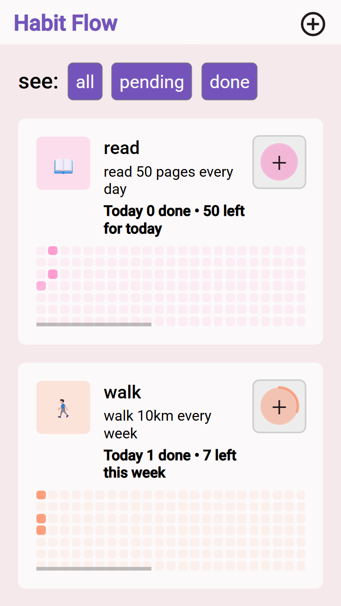
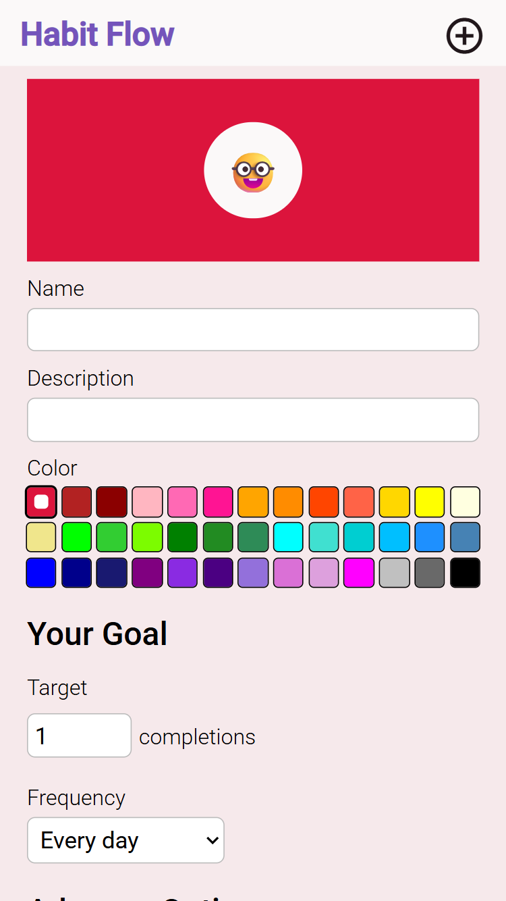
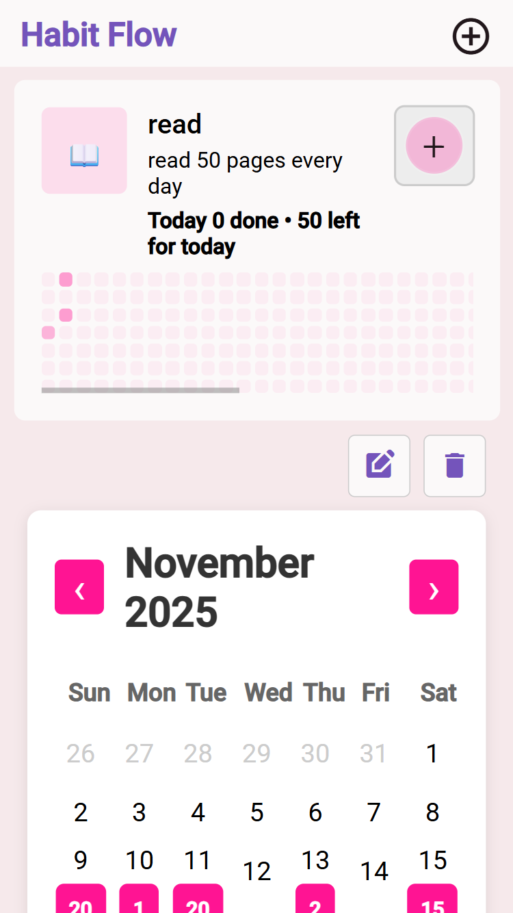

# Habit Tracker

A habit tracking application that visualizes your progress with a GitHub-style graph. Built with ASP.NET and Angular, this app helps you build consistent habits by providing clear visual feedback on your daily commitment.

## Features

- **Habit Management**: Create, edit, and delete custom habits to track
- **Daily Check-ins**: Mark habits as complete each day with a simple click
- **Visual Progress**: View your habit consistency with an intuitive contribution graph
- **Responsive Design**: Seamless experience across desktop, tablet, and mobile devices

# Screenshots

<div>
    
    
    
</div>

## Technology Stack

### Backend
- **ASP.NET Core**: RESTful API built with C# and .NET
- **Entity Framework Core**: ORM for database operations
- **SQL Server**: Relational database for data persistence
- **JWT Authentication**: Secure user authentication and authorization

### Frontend
- **Angular**: Modern TypeScript-based SPA framework
- **RxJS**: Reactive programming for API calls and state management

## Prerequisites

Before running this application, ensure you have the following installed:

- [.NET SDK 8.0+](https://dotnet.microsoft.com/download)
- [Node.js 18+](https://nodejs.org/) and npm
- [Angular CLI](https://angular.io/cli) (`npm install -g @angular/cli`)
- [SQL Server](https://www.microsoft.com/en-us/sql-server/sql-server-downloads) or SQL Server Express

## Getting Started

### Backend Setup

1. **Clone the repository**
   ```bash
   git clone https://github.com/Margarita5112002/habit-tracker-app
   cd HabitTracker
   ```

2. **Configure the database**
   
   Update the connection string in `appsettings.json`:
   ```json
   {
     "ConnectionStrings": {
       "DefaultConnection": "Server=localhost;Database=HabitTrackerDb;Trusted_Connection=True;"
     }
   }
   ```

3. **Run database migrations**
   ```bash
   cd HabitTracker
   dotnet ef database update
   ```

4. **Build Frontend**
   ```bash
   cd ../Frontend
   npm install
   npm run build
   ```

5. **Start the API**
   ```bash
   cd ../HabitTracker
   dotnet run --launch-profile https
   ```
   
   The API will be available at `https://localhost:7213`

### Frontend Setup

1. **Navigate to the Angular project**
   ```bash
   cd Frontend
   ```

2. **Install dependencies**
   ```bash
   npm install
   ```

3. **Configure API endpoint**
   
   Update the API URL in `src/environments/environment.ts`:
   ```typescript
   export const environment = {
     apiUrl: 'https://localhost:7213/api'
   };
   ```

4. **Start the development server**
   ```bash
   ng serve
   ```
   
   Navigate to `http://localhost:4200` in your browser

## API Endpoints

### Authentication
- `POST /api/auth/register` - Register a new user
- `POST /api/auth/login` - Login and receive JWT token

### Habits
- `GET /api/habits` - Get all habits for the authenticated user
- `GET /api/habits/{id}` - Get a specific habit
- `POST /api/habits` - Create a new habit
- `PUT /api/habits/{id}` - Update a habit
- `DELETE /api/habits/{id}` - Delete a habit
